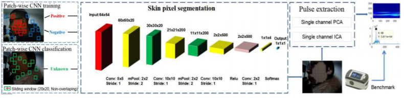
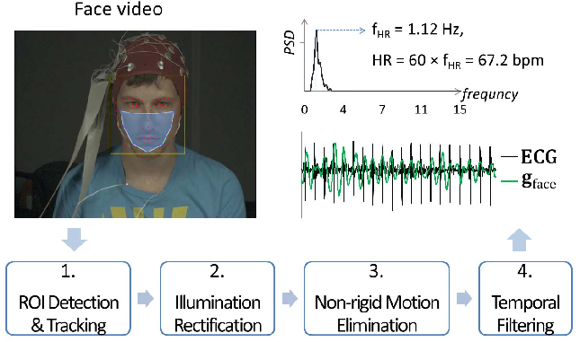
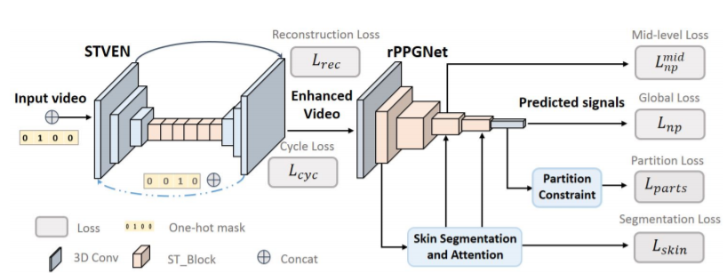

# Heart Rate Estimation using CNNs and DSP

### Detecting Pulse from Head Motion in Video

-   Newtonian reaction from influx of blood    
    -   That is, head wobbles when blood rushes in head (simple Newton's 3rd Law)
-   ROI is inside facial boundaries excluding eye regions. This is for minimizing errors caused by eye blinks.
-   Bandpass/Temporal filter is applied to extract signals in a specific freq. range
-   PCA was applied to transformed features from ROI.
-   Signals matching closest to human heart rates are taken.

### Non-contact heart rate monitoring by combining CNN skin detection and remote photoplethysmography via a low-cost camera

-   Uses minor color variations instead of micro-motions.
-   Used CNN to classify 64 x 64 crop as a skin portion or not.
-   Training for this network was done in supervised manner using a custom dataset.
-   Sliding window and above CNN is used to obtain all obtainable skin portion in the image (output is a binary mask, used to dot product with the features for subsequent steps).
-   **Note:** This method does not perform Illumination Rectification.

### Remote Heart Rate Measurement from Face Videos under Realistic Situations

-   This method performs Illumination Rectification.

### Remote Heart Rate Measurement from Highly Compressed Facial Videos: end-to-end DL solution with Video Enhancement

-   Hidden rPPG information enhancement and attention networks used.
-   The method includes two parts:
    -   Spatio-Temporal Video Enhancement Network (STVEN) for video enhancement
    -   rPPG network (rPPGNet) for rPPG signal recovery
-   rPPGs analyze fine details from skin surfaces, making frame quality very critical. Hence, It’s important to counter video compression quality losses for an accurate rPPG stage.
-   Two stage: video enhancement using STVEN (spatio-temporal video enhancement) + rPPGNet.
-   STVEN: match video distribution - conditional distribution for generator output and original uncompressed video should be equal. Losses: L1 reconstruction + cycle-loss (for better reconstruction)
-   rPPGNet: end-to-end spatio-temporal CNN to predict rPPG signal directly from T-frame video. Authors also introduce a parallel skin segmentation branch (with attention mechanism), as detecting skin accurately is highly desirable for rPPG.
-   rPPGNet independently outperforms on various benchmarks, with fine-grained learning using STVEN enhancing performance further.

### Meta-rPPG: Remote Heart Rate Estimation using a Transductive Meta-Learner

-   This method is similar to the previous end-to-end DL solution.
-   The advantage is that it uses Transductive inference. Transductive inference is a common scenario where the learner, in addition to a labeled training sample, has access to all of the test points, without their labels.
-   This enables self-supervised online training during deployment.

## Problems in the field:

-   People of color perform poorly while testing using these methods.
    
-   Input video is quantized, i.e. only 8*3 bits for representing a pixel. This quantization can make it difficult to extract the micro-features in the first place, let alone preprocessing and further steps.
