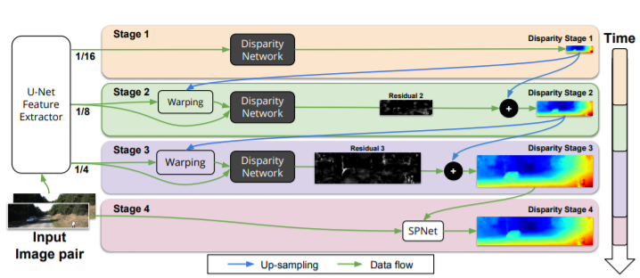
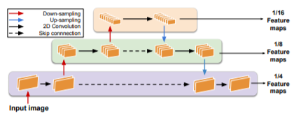
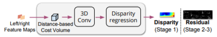
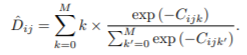

# Anytime Stereo Image Depth Estimation on Mobile Devices [[pdf]](https://arxiv.org/pdf/1810.11408.pdf)

-   The architecture mentioned in the paper is named _AnyNet_.
-   The final model can process 1242×375 resolution images within a range of 10-35 FPS on an NVIDIA Jetson TX2.
-   The network actually outputs Disparity Map, which is in the format of the number of pixels the right image varies w.r.t left image, otherwise the pixel disparities will be normalized with the image width dimension.
-   This Disparity Map can be extended to Depth using the camera information (like the distance between the stereo lens, etc.) with the help of off-the-shelf algorithms.

**Note:**
With respect to left image, the pixels responsible for the corresponding point in the FOV in the right image will always be leftwards. Objects at infinity will have no disparity between left and right images. More closer the objects are, more the disparities are.

## Network Details
The network has the following components:
1. U-Net Feature Extractor
2. Disparity Network
3. Spatial Propagation Network (SPNet) 

The left and right input images are passed into U-Net. The extracted features. The extracted features are used in the later stages.

The disparity estimation module has multiple stages (typically 3+1). The last stage is where the _SPNet_ is used, and is basically a postprocessing module.

The network provides a flexibility to obtain output from any of the stage but at the cost of less accuracy and refinement. However, the first stage has to be done to obtain the initial coarse prediction. The subsequent layers simply enhance and refine the already predicted coarse disparity map from previous stage, along with the bigger input feature maps.

The _Disparity Network_ constructs a 3D cost matrix (HxWxM). In essence, each left image pixel is compared to every right image pixel to its left till a certain range M, using L1 distance. We now need to minimize this cost matrix along the dimension M. A weighted average (_Disparity Regression_) is taken over this range of shifted pixels (i.e along dimension M). This weighted average is the output for this stage. The equation below gives us the pixel difference or the average of pixel differences with lowest cost values.

The exact details of the U-Net and the Disparity Network is left to the reader.

The _SPNet_ is simply a set of convolutional layers with skip connections to enhance the final output quality. It refines the output and removes noise.
