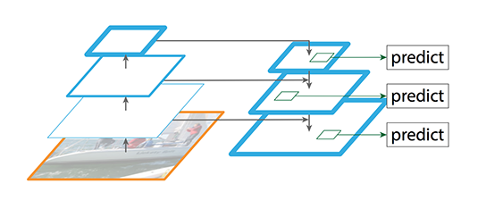
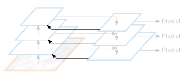
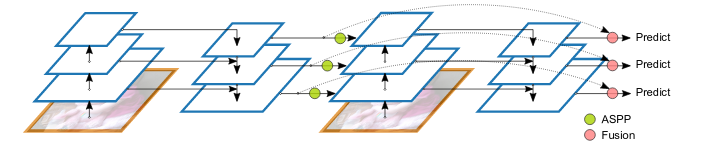
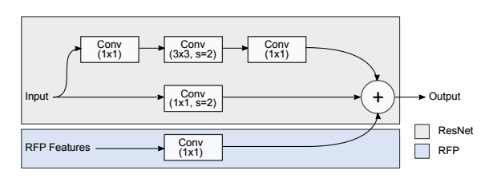
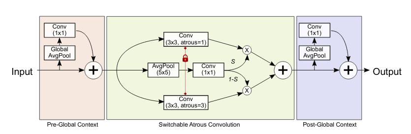

# DetectoRS: Detecting Objects with Recursive Feature Pyramid and Switchable Atrous Convolution [[pdf]](https://arxiv.org/pdf/2006.02334.pdf)

-   The architecture mentioned in the paper is named _DetectoRS_.
-   SoTA on COCO test-dev dataset.
-   ResNet-50 backbone is used.

#### Important Modules:
-   Feature Pyramid Network (**FPN**) 
-   Recursive Feature Pyramid (**RFP**) 
-   Atrous Spatial Pyramid Pooling (**ASPP**) 
-   Switchable Atrous Convolutions (**SAC**) 

Recursive Feature Pyramids (**RFP**) and Switchable Atrous Convolutions (**SAC**) are significant findings in this paper.  **RFP**s are basically **FPN** units looped.

## Feature Pyramid Network (FPN)
Feature Pyramid Network (**FPN**) is a feature extractor designed for such pyramid concept with accuracy and speed in mind. It replaces the feature extractor of detectors like Faster R-CNN and generates multiple feature map layers (**multi-scale feature maps**) with better quality information than the regular feature pyramid for object detection. It is very similar to U-Nets in the way that there is a down-sampling bottom-up path and a subsequent top-down path. The important difference in FPN is that there are multiple prediction pathways in the up-sampling path for each resolution, whereas in U-Net, the prediction pathway is only at the end of the up-sampling pathway. 

## Recursive Feature Pyramid (RFP)
Recursive Feature Pyramid (**RFP**) enhances FPN to be recursive, that is, each layer in bottom-up path takes in another input of feature maps of same dimension from the corresponding layer in top-down  path of previous iteration of the recursion. RFP adds feedback connections to FPN. 

Unrolling the recursion, the following is observed.

## Atrous Spatial Pyramid Pooling (ASPP)
ASPP is the connecting module for the RFP. ASPP is used for probing the original image with multiple filters that have complementary effective fields of view, thus capturing objects as well as useful image context at multiple scales. Rather than actually resampling features, the mapping is implemented using multiple parallel atrous convolutional layers with different sampling rates. 

## Switchable Atrous Convolution (SAC)
Every 3x3 Convolution in the backbone is replaced with SAC. SAC is used for extracting the global context and perform computation depending on the scale of the input feature. Global contexts are used before and after the switching mechanism (pre-global context helps the switch in making more stable switching prediction). Switching mechanism uses same 3x3 weight locked into two 3x3 convolution with different atrous rates. A soft switch is implemented as a linear combination of both the atrous convolutions depending upon the switch. The switch is implemented as 5x5 Average Pooling followed by a 1x1 Convolution. 

